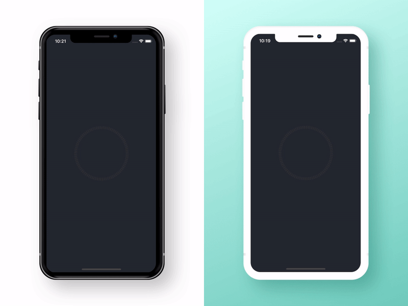
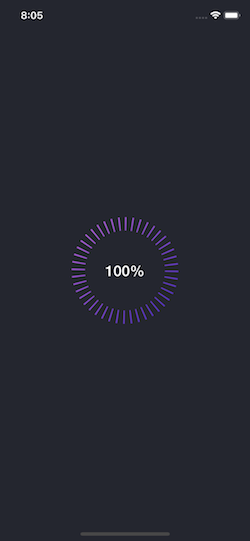
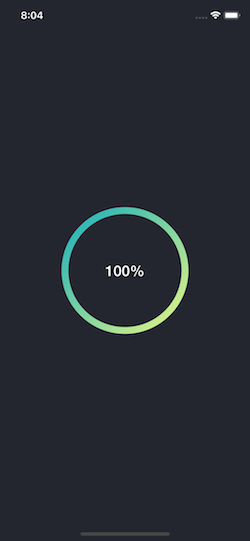
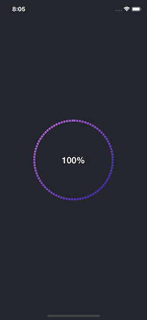

# TYProgressBar

[](https://cocoapods.org/pods/TYProgressBar/)
[](https://cocoapods.org/pods/TYProgressBar/)
[](https://cocoapods.org/pods/TYProgressBar/)

Custom animating gradient progress bar. <br />



## Installation

TYProgressBar is available through [CocoaPods](https://cocoapods.org). To install
it, simply add the following line to your Podfile:

```ruby
pod 'TYProgressBar'
```

How to use 
---------
```swift
let progressBar = TYProgressBar()

func setupProgressBar() {
progressBar.frame = CGRect(x: 0, y: 0, width: 220, height: 220)
progressBar.center = self.view.center
self.view.addSubview(progressBar)
}
```
Customize 
---------
You can change gradient color and label font and text color 
```swift
progressBar.trackColor = UIColor(white: 0.2, alpha: 0.5)
progressBar.gradients = [UIColor.red, UIColor.yellow]
progressBar.textColor = .orange
progressBar.font = UIFont(name: "HelveticaNeue-Medium", size: 22)!
progressBar.lineDashPattern = [10, 4]   // lineWidth, lineGap
progressBar.lineHeight = 5
```

Show progress 
---------
```swift
progressBar.progress = 0.5    // between 0 to 1
```

  

## Author

Yash Thaker, yashthaker7@gmail.com

## License

TYProgressBar is available under the MIT license. See the LICENSE file for more info.
